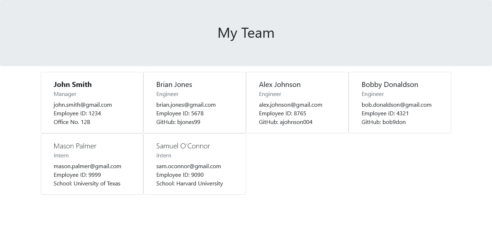

# team-profile-generator

## Description
This command line application generates a webpage for a development team from the user's input. Upon running it, it will ask the user to enter the team manager's name, employee ID, email, and office number. After that, it will ask if the user wants to add an engineer or an intern, or if they are finished. If an engineer is selected, it will ask for their name, employee ID, email, and GitHub username. If an intern is selected, it will ask the user to enter their name, employee ID, email, and their school. After each employee is added, the program will prompt the user again to select engineer, intern, or finished. Upon selecting finish, the program will render the `team.html` file in the output folder and terminate.

This program uses Node.js with the Inquirer package for the input prompts. It also uses the Jest package for testing purposes.

## Screenshots
